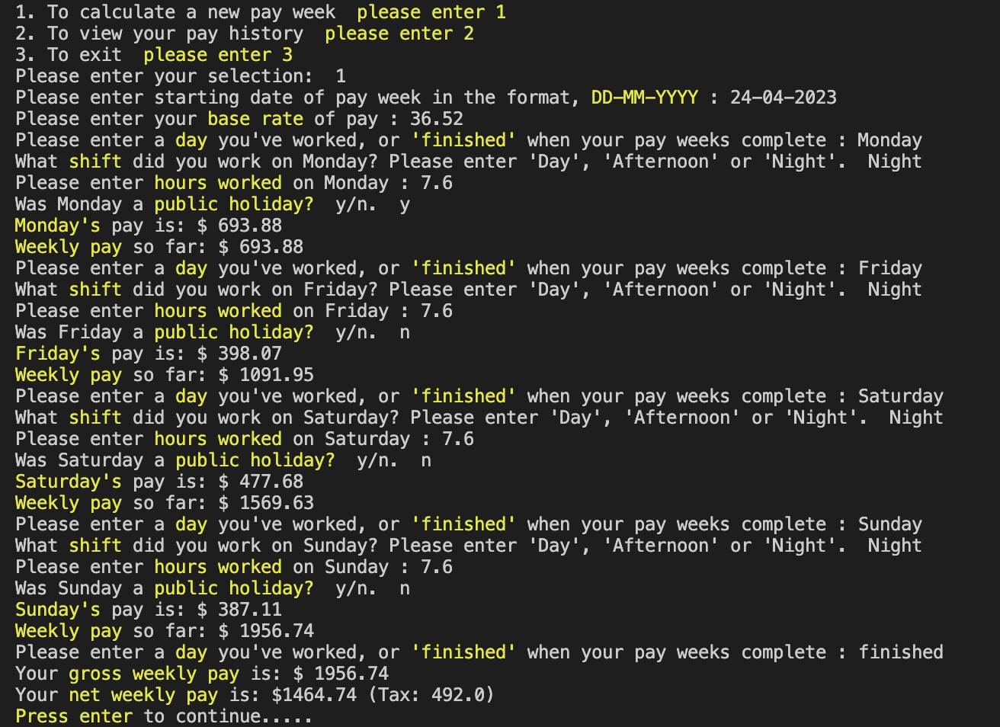
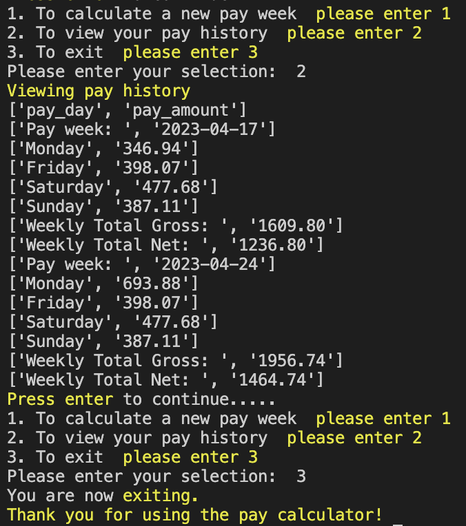
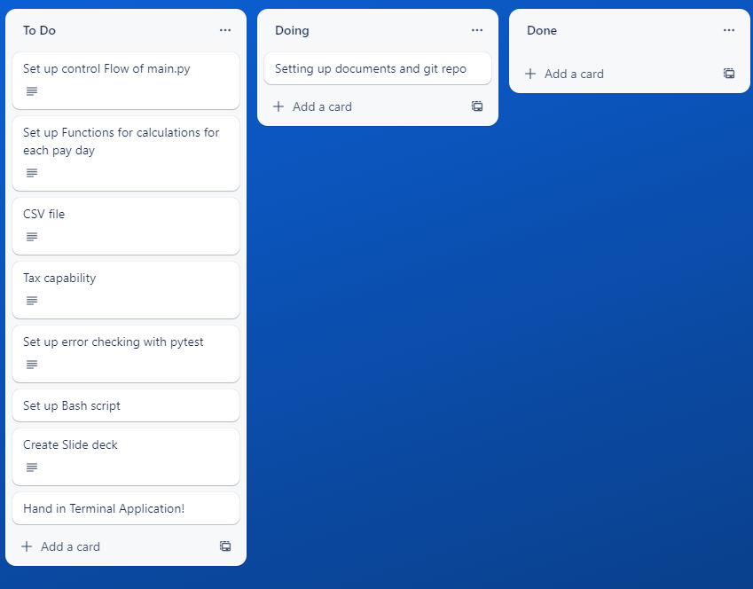
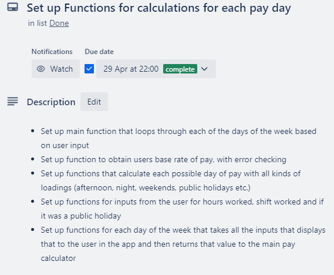
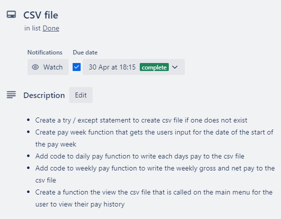
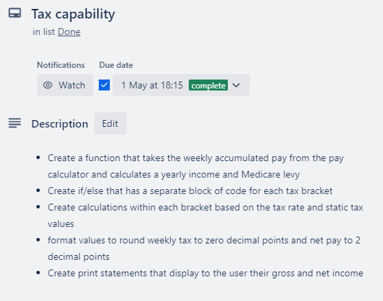
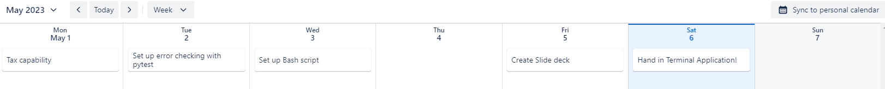
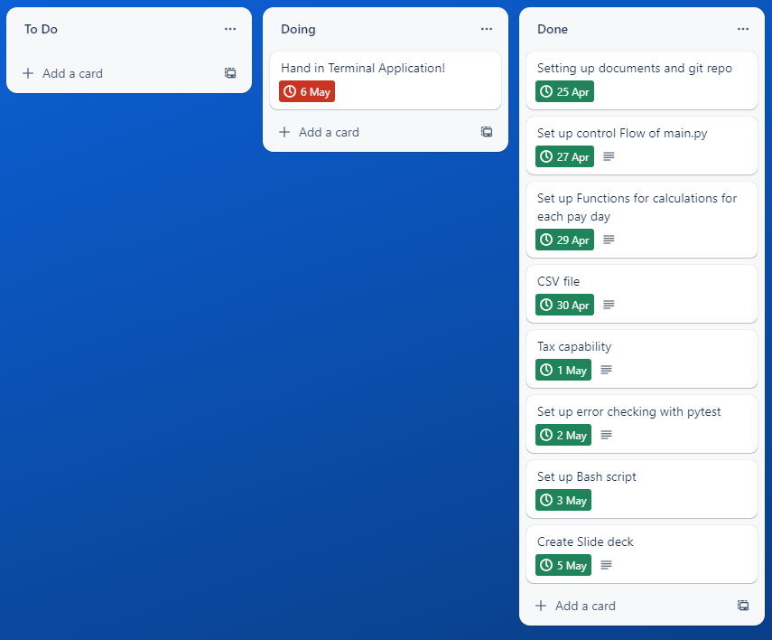

# T1A3 - Terminal Application

## References 

Majority of my sources were from class material at coder academy.

Things added that were not class material:

[datetime](https://docs.python.org/3/library/datetime.html)

[tax rates](https://atotaxrates.info/individual-tax-rates-resident/ato-tax-rates-2023/)

[medicare levy](https://www.ato.gov.au/Individuals/Medicare-and-private-health-insurance/Medicare-levy/)

## Links

[Github repositry](https://github.com/Scott12141/Terminal-Application)

[Youtube link](https://youtu.be/OgWdE5Sfk78)

## Code Styling

This application will follow the PEP 8 style guide for python programming. [PEP 8](https://peps.python.org/pep-0008/)

## Features

### Pay week calculator:

User will be prompted to enter their base rate of pay, the day of the week worked, which shift they worked on the amount of hours. After each entry, that days pay a running total for the week will be displayed to the user. 
Once the user enters that theyre finished, a summary of the gross weeks pay and net weeks pay will be displayed for the user.

This is a typical pay week entry from a user in the application:



### Pay histroy csv:

When the application is opened a Comma Seperated Value (CSV) file will be created to be altered by inputs from the user.
At the start of the pay calculator the application will ask the user for a weekly starting date that will be written to the start of the csv.
Each daily entry of the pay week calculator will be written to a csv file, and once the user has finished his pay week the end of week values of gross and net will be entered into the csv file also.
Whenever the user wants to view his pay history he can use the second option on the menu to get the csv printed onto the screen for their viewing.

The pay history for 2 weeks of pay:



### Fully tax capable

This application is fully capable of calculating the payg weekly tax on any input that the user enters with code that covers every tax bracket in australia.
Heres the code for all tax brackets:
```py
# Full tax calculations based on users tax bracket once weekly pay is determined, to return gross and net pay to the user.
def weekly_pay(weekly_accumulated):
    yearly_income = (weekly_accumulated / 7) * 365
    medilevy = yearly_income * .02
    weekly_medilevy = (medilevy / 365) * 7

    if yearly_income <= 18200:
        print(f"Your {fg('yellow')}weekly pay{attr('reset')} is: $",format(weekly_accumulated,".2f"))
        with open(file_name, "a")as pay_file:
            writer = csv.writer(pay_file)
            writer.writerow(["Weekly Total Gross: ", format(weekly_accumulated,".2f")])
            

    elif yearly_income > 18200 and yearly_income <= 29032:
        yearly_tax = (yearly_income - 18200) * .19
        weekly_tax = (yearly_tax / 365) * 7
        weekly_tax = float(format(weekly_tax,".0f"))
        net_pay = weekly_accumulated - weekly_tax
        net_pay = format(net_pay,".2f")
        print(f"Your {fg('yellow')}gross weekly pay{attr('reset')} is: $",format(weekly_accumulated,".2f"))
        print(f"Your {fg('yellow')}net weekly pay{attr('reset')} is: ${net_pay} (Tax: {weekly_tax})")
        with open(file_name, "a")as pay_file:
            writer = csv.writer(pay_file)
            writer.writerow(["Weekly Total Gross: ", format(weekly_accumulated,".2f")])
            writer.writerow(["Weekly Total Net: ", net_pay])

    elif yearly_income > 29032 and yearly_income <= 45000:
        yearly_tax = (yearly_income - 18200) * .19
        weekly_tax = ((yearly_tax / 365) * 7) + weekly_medilevy
        weekly_tax = float(format(weekly_tax,".0f"))
        net_pay = weekly_accumulated - weekly_tax
        net_pay = format(net_pay,".2f")
        print(f"Your {fg('yellow')}gross weekly pay{attr('reset')} is: $",format(weekly_accumulated,".2f"))
        print(f"Your {fg('yellow')}net weekly pay{attr('reset')} is: ${net_pay} (Tax: {weekly_tax})")
        with open(file_name, "a")as pay_file:
            writer = csv.writer(pay_file)
            writer.writerow(["Weekly Total Gross: ", format(weekly_accumulated,".2f")])
            writer.writerow(["Weekly Total Net: ", net_pay])

    elif yearly_income > 45000 and yearly_income <= 120000:
        yearly_tax = (yearly_income - 45000) * .325
        weekly_static_tax = (5092 /365) * 7
        weekly_tax = ((yearly_tax / 365) * 7) + (weekly_medilevy + weekly_static_tax)
        weekly_tax = float(format(weekly_tax,".0f"))
        net_pay = weekly_accumulated - weekly_tax
        net_pay = format(net_pay,".2f")
        print(f"Your {fg('yellow')}gross weekly pay{attr('reset')} is: $",format(weekly_accumulated,".2f"))
        print(f"Your {fg('yellow')}net weekly pay{attr('reset')} is: ${net_pay} (Tax: {weekly_tax})")
        with open(file_name, "a")as pay_file:
            writer = csv.writer(pay_file)
            writer.writerow(["Weekly Total Gross: ", format(weekly_accumulated,".2f")])
            writer.writerow(["Weekly Total Net: ", net_pay])

    elif yearly_income > 120000 and yearly_income <= 180000:
        yearly_tax = (yearly_income - 120000) * .37
        weekly_static_tax = (29467 /365) * 7
        weekly_tax = ((yearly_tax / 365) * 7) + (weekly_medilevy + weekly_static_tax)
        weekly_tax = float(format(weekly_tax,".0f"))
        net_pay = weekly_accumulated - weekly_tax
        net_pay = format(net_pay,".2f")
        print(f"Your {fg('yellow')}gross weekly pay{attr('reset')} is: $",format(weekly_accumulated,".2f"))
        print(f"Your {fg('yellow')}net weekly pay{attr('reset')} is: ${net_pay} (Tax: {weekly_tax})")
        with open(file_name, "a")as pay_file:
            writer = csv.writer(pay_file)
            writer.writerow(["Weekly Total Gross: ", format(weekly_accumulated,".2f")])
            writer.writerow(["Weekly Total Net: ", net_pay])  

    else:
        yearly_tax = (yearly_income - 180000) * .45
        weekly_static_tax = (51667 /365) * 7
        weekly_tax = ((yearly_tax / 365) * 7) + (weekly_medilevy + weekly_static_tax)
        weekly_tax = float(format(weekly_tax,".0f"))
        net_pay = weekly_accumulated - weekly_tax
        net_pay = format(net_pay,".2f")
        print(f"Your {fg('yellow')}gross weekly pay{attr('reset')} is: $",format(weekly_accumulated,".2f"))
        print(f"Your {fg('yellow')}net weekly pay{attr('reset')} is: ${net_pay} (Tax: {weekly_tax})")
        with open(file_name, "a")as pay_file:
            writer = csv.writer(pay_file)
            writer.writerow(["Weekly Total Gross: ", format(weekly_accumulated,".2f")])
            writer.writerow(["Weekly Total Net: ", net_pay]) 
```

### Flexability of users

Another feature of this application is that it can be used by any worker, whether they are a shift worker, service worker or someone who owns their own business. All they need is the base rate of pay and to enter the inputs when promoted to output what they need or to export the csv and use the information within to further process the data.
  
## Implementation Plan 

    - Start of Implementation plan:



    - Pay week calculator checklist: 



    - CSV file checklist:



    - Tax capability:



    - Week 1 timeline:


    - Week 2 timeline:



    - End of Implementation plan:




## Installation instructions

    - Help Documentation:

- Extract the ScottTaylor_T1A3 folder to your desktop.

- Open up your Terminal (Ubuntu on Windows).

- Type "cd desktop/ScottTaylor_T1A3/src" into your terminal to access the folder.

- Your terminal will require the python package installed to run the application, these are often included as part of your OS, to check if this is installed:
    - type: "python --version", if it shows the version of python you have installed move to the next step if it tells you its not installed 
    - now type: "python3 --version". if it shows the version of python3 you have installed move to the next step if it tells you its not installed 
    - visit [Python Website](https://www.python.org/downloads/) and follow installion instructions

- To now access the application you will need to run the bash script which creates the executable to run the program which will create and activate the virtual environment install any packages and open up the main file to start using the application.
